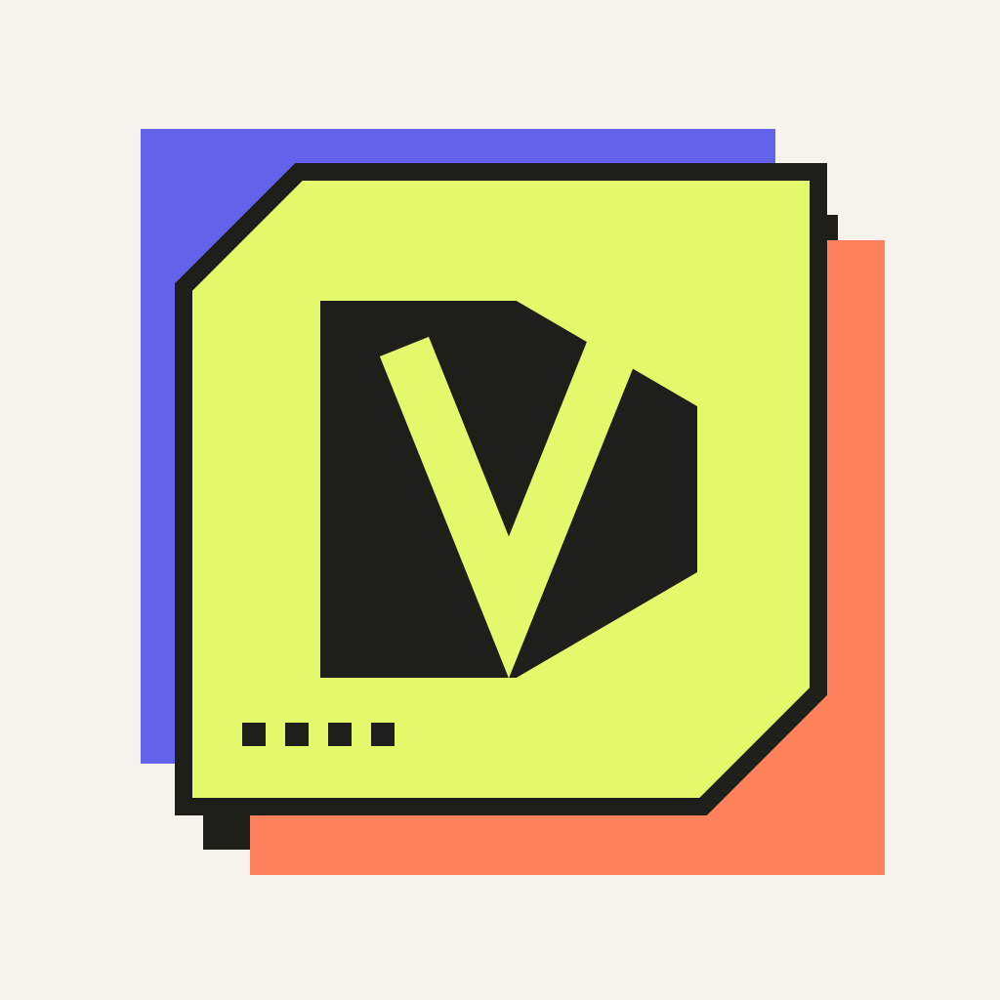
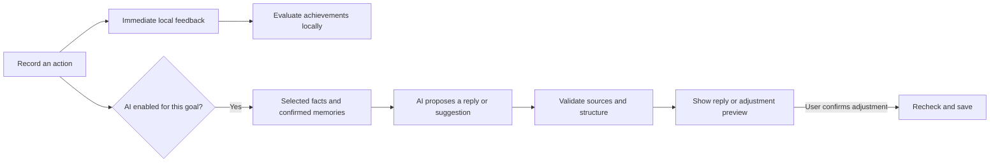

<div align="center">
  
  <h1>DayVault</h1>
  <p><strong>A small daily record. Something worth looking back on.</strong></p>
  <p>Native iPhone recording · Earned achievements · An optional AI companion</p>
  <p><a href="README.md">简体中文</a> · <strong>English</strong></p>
  <p><a href="#a-look-inside">Screenshots</a> · <a href="#what-you-can-do">Features</a> · <a href="#your-first-minute">Your first minute</a> · <a href="#run-it-locally">Quick start</a> · <a href="docs/DEVELOPMENT.en.md">Developer guide</a></p>
</div>

**Versions:** [v1.1.0 bilingual introduction](docs/releases/v1.1.0.md) · [New release](https://github.com/Jack-Li-Npu/DayVault/releases/tag/v1.1.0) · [Original v1.0.0 introduction](https://github.com/Jack-Li-Npu/DayVault/blob/v1.0.0/README.en.md)


*The banner is an original brand illustration, not an app screenshot. Actual interface captures appear below.*

---

DayVault starts with a familiar feeling: **you have kept showing up, and you want that effort to mean something when you look back.** A completed workout, another evening of study, or a routine kept for months deserves more than a disappearing checkbox.

The app keeps daily recording simple. Your completed actions build a collection of achievements and clothing for an original character. If you choose, a small origami AI companion can respond to the records you share, help design personal milestones, and suggest changes to a plan. It is an optional witness to your progress—not an all-in-one life coach or a compulsory chat screen.

> **Current status:** a private development prototype, not an App Store or TestFlight release. The app currently ships in **Simplified Chinese**. Live planning has succeeded, but recent upstream HTTP 504 failures remain unresolved. Personal provider/model settings and credentials are excluded from this release; example values in documentation are redacted placeholders. See [verification and limitations](#verification-and-limitations).

## A look inside

These are actual iOS Simulator captures from isolated preview sessions. They show the implemented interface, with local sample records where applicable—not generated product mockups or proof of a successful live AI conversation.

<table>
  <tr>
    <th align="center">Start with today</th>
    <th align="center">Record without a long form</th>
    <th align="center">Celebrate together</th>
  </tr>
  <tr>
    <td align="center"></td>
    <td align="center"></td>
    <td align="center"></td>
  </tr>
  <tr>
    <td align="center">A sequential list, without an hourly ruler.</td>
    <td align="center">Only add timing details when you need them.</td>
    <td align="center">A skippable duet, with replay that never adds progress.</td>
  </tr>
</table>

## What you can do

### 1. Keep a record before making a system

Open the app and record something immediately. There is no mandatory questionnaire, goal setup, conversation, or introductory slideshow. The home screen emphasizes the date, today's items, a compact companion area, and the add button. Calendar, Insights, templates, appearance, and settings stay out of the first-use flow.

The editor starts with **title, date, and save**. Time, duration, category, repetition, reminders, notes, and templates are available behind advanced controls. Three timing states remain distinct:

| State | What it means |
| --- | --- |
| Date only | Something to do on a particular day, without an invented midnight appointment or duration. |
| Specific time | A scheduled start and duration, with optional reminder and actual-time tracking. |
| Inbox | Something recorded without an assigned day. |

Date-only items do not inflate planned-minute totals, time-conflict warnings, or on-time statistics. Recurring items keep sparse per-occurrence records, so completing or moving one occurrence does not require generating an endless calendar. Planned and actual time remain separate.

Recording, existing achievement evaluation, and local animation work offline and without AI credentials. Calendar access and notification permission are optional. Challenge suggestions are **plan templates**, not invented popular competitions or a live enrollment system.

### 2. Let your character carry what you have earned

The Vault is a darker, more expressive counterpart to the paper-like daily list. It contains your character studio, wardrobe, and achievement collection. The original layered streetwear character breathes, blinks, changes pose, and can wear six achievement-earned pieces across three equipment slots.

<table>
  <tr>
    <th align="center">Your character studio</th>
    <th align="center">A wardrobe earned through actions</th>
    <th align="center">Calendar, one level deeper</th>
  </tr>
  <tr>
    <td align="center"></td>
    <td align="center"></td>
    <td align="center"></td>
  </tr>
</table>

*The Vault and Calendar captures show the current build. The wardrobe capture is an isolated preview from the earlier avatar build, showing the equipment system retained in this release. All use sample data, with no private messages or live AI replies.*

Visible locked equipment can be tried on without claiming ownership. Concealed rewards keep their appearance and criteria secret until earned. Pausing a routine does not remove earned equipment, and previewing an unlock sequence never grants it.

The character, companion, badges, and motion are drawn in code. No borrowed game sprites, online image generation, or remotely hosted artwork are needed at runtime. See the [design references and credits](ATTRIBUTIONS.md).

### 3. Collect common achievements—and milestones made for your goal

The existing **24 public achievements** remain: 16 visible and 8 concealed. “Public” means a shared catalog of rules, not public disclosure of your records. These achievements determine the existing equipment rewards and retain their own collection count.

After you explicitly enable AI for a goal, it can design one batch of **up to two visible personal achievements and one hidden surprise**. A retry or repeated visit does not create an unlimited stream of new rewards. Personal achievements live in the same collection under their own group; they do not grant public equipment or alter public collection totals.

The model designs the name, description, clue, and a combination of approved badge components. **The app decides whether you have earned it.** Only three local, testable rule families are supported:

| Personal rule | What the app counts |
| --- | --- |
| Completed actions | Valid completed occurrences linked to the current goal. |
| Active dates | Distinct dates with a completed occurrence for that goal. |
| Completed cycles | Fixed seven-day cycles meeting the weekly frequency you have already confirmed. Missing a cycle does not erase earlier qualifying cycles. |

Visible achievements show the actual condition and progress. Hidden achievements show only **Dormant → Faint Signal → Resonant**, with a clue at the final stage; their name, numbers, and artwork remain concealed. Hidden rules are not included in ordinary companion conversation requests.

Rules and their versions freeze when enabled. AI cannot lower a threshold behind the scenes, declare that a skill has been mastered, or write an unlock date. You may explicitly associate older records with a goal; qualified historical achievements appear as a retrospective, without pretending the companion witnessed those years. Earned eligibility remains permanent, while corrections to its source evidence are disclosed.

### 4. Build a shared history, not a maintenance chore

Your character represents you. The small nonhuman origami character is a separate, optional companion for the selected goal. Its duet develops across **0, 7, and 30 distinct recorded days after companionship is enabled**: an awkward handoff becomes coordinated movement, then a more exaggerated joint finish.

Rest days and absences do not reverse this growth. Imported history can support an achievement, but does not fabricate days spent together.

A normal completion gets a brief local reaction without waiting for a network response. Automatic companion text is limited to once per day, with additional milestone responses allowed. User-initiated light conversation is not subject to that display limit. Larger celebrations are opened by the user, last about six seconds, and can be skipped or replayed. Reduce Motion replaces theatrical movement with a static result and a short fade.

The aim is to make a real accomplishment feel visible—not to keep interrupting the user with celebration screens.

### 5. Let AI help, while keeping the facts and decisions yours

AI stays inside the current goal. Its context is limited to authorized records, messages you send, and memories you confirm. Key dates and counts come from the app rather than being invented in a reply.

A suggested memory—such as an arrangement that seemed to work—requires confirmation before reuse. You can inspect its sources, edit it, or delete it. Editing or removing a source invalidates dependent text and memories. The app does not read conversations from Codex or other AI tools.

Optional AI planning can turn a loosely described goal into a proposed schedule. For an existing goal, the adjustment flow is deliberately narrower:

An adjustment may move the date or time of an unstarted occurrence in the selected goal. It cannot delete work, reduce duration, lower the weekly target, extend the deadline, change another goal, or rewrite completed history. The app checks other tasks, authorized Calendar busy intervals, rest constraints, and live revisions before applying the batch. Stale proposals require another preview; undo also checks for later changes and conflicts.



### 6. Share an achievement without sharing everything

Share cards are rendered on the device. They can include your character, an earned achievement, the recorded span of activity, and a memory you choose to include. Private messages are excluded by default. You preview the result and choose the destination through the system share sheet; the app never posts automatically.

DayVault does not invent global rarity, “better than 99%” claims, or competitor counts. These are your recorded actions—not independently verified athletic results. Pride does not need a fabricated leaderboard.

## Your first minute

1. Tap **记一件事** (“Record something”), enter a title, and save. Goals, AI, notifications, and Calendar access are not prerequisites.
2. Tap the item's check control when you finish. Use **开始** (“Start”) only when you want to record actual time.
3. Tap the small user character in the top-left corner to open the Vault, wardrobe, and achievement collection.
4. When you want to build toward a longer-term direction, create a goal and explicitly associate older records. Open **AI 帮我排** (“Help me plan”) to try a plan template or request a schedule from an imprecise goal.
5. To enable goal-specific companionship, tap the origami character, review what will be sent, and opt in. If the model service is unavailable, the app reports it; daily recording remains usable.

## Run it locally

You need a Mac with **Xcode 26 or newer**. The iPhone deployment target is **iOS 18+**, using Swift 6. Repository access is required while the project is private.

```sh
git clone https://github.com/Jack-Li-Npu/DayVault.git
cd DayVault
open DayVault.xcodeproj
```

Select the **DayVault** scheme, choose an installed iPhone simulator, and press **⌘R**. The checked-in Xcode project is ready to open; XcodeGen is only needed when regenerating it after configuration changes. Simulator launches use local persistence by default, and basic recording does not need a model endpoint.

For a physical iPhone, set your Apple Developer team for both the app and widget targets, then configure matching bundle IDs, App Group, and CloudKit containers. The included StoreKit configuration supports local purchase testing; it is not an active App Store product.

The development guides cover signing, cloud containers, local AI proxy setup, skill bundling, tests, and release checks:

- [English developer guide](docs/DEVELOPMENT.en.md)
- [中文开发指南](docs/DEVELOPMENT.zh-CN.md)

## Verification and limitations

The following results were recorded locally on **2026-09-10**. They are a dated verification snapshot, not a live CI badge or a production reliability guarantee.

| Suite | Passed | Examples covered |
| --- | ---: | --- |
| Swift core | 57 | Actual V1 → V2 disk migration, recurrence, date precision, achievement rules and validation. |
| App | 40 | Goal history, consent changes, source invalidation, adjustment safety, save-failure rollback and retry. |
| iOS UI | 15 | Title-only recording, optional companion setup, shared achievement collection, duet replay/skip, large text and reduced motion. |
| Deno server contracts | 30 | Strict model-output validation, Chinese fixtures, invalid references and configuration boundaries. |
| **Total** | **142** | Deterministic local tests; not a live model-quality evaluation. |

**Live AI is partially verified, not release-ready.** On 2026-09-10, user-authorized initial planning succeeded through `https://api.example.com/v1/responses` using `example-model`, `medium` and prompt `1.1.0`, after schema and transport fixes. Earlier connectivity, companion and personal-achievement checks also succeeded. The relay still has intermittent gateway failures, and adjustment proposals' `invalid_structured_output` has not been reverified. No personal records were sent or generated test schedules saved. [Integration evidence and limitations →](docs/AI-PLANNER-LIVE-VALIDATION.zh-CN.md)

Companion responses, new AI-designed achievements, and AI adjustment generation require a working endpoint. When unavailable, these functions report the problem. The original planner's deterministic local preview is explicitly labeled; it is not presented as a model reply. Existing recording, earned achievements, and local motion remain usable.

Real multi-device CloudKit behavior, signed-device permission flows, App Store purchase configuration, and the companion-value user study remain release gates. The [Journey validation protocol](Design/Journey-Validation.md) compares a statistics-only experience with one grounded in real history, so testing can examine the value of companionship rather than animation alone.

## Under the surface

| Area | Implementation |
| --- | --- |
| Native app | SwiftUI, SwiftData, EventKit, UserNotifications, Swift Charts, StoreKit 2, and Apple haptic APIs. |
| Domain core | Local `DayVaultCore` Swift package with recurrence, versioned data models, achievement evaluation, and service contracts. |
| Persistence | Frozen V1 schema and V2 migration; sparse occurrence logs; private CloudKit storage with application-level reconciliation. |
| Widgets | WidgetKit and App Intents, using a minimal App Group snapshot rather than the full journal. |
| AI boundary | A server-side proxy, versioned instruction bundles, strict output schemas, and validation on both server and app. |

There are no third-party runtime dependencies in the iOS app. The optional AI server is separate from local recording. The bundled instruction packages are loaded according to request purpose: `dayvault-goal-planner`, `dayvault-achievement-designer`, and `dayvault-companion`. They are executable request inputs with schemas and contract tests, not Markdown files left unused in the repository.

## Privacy and ownership

Schedule history and related goal data live on the device and, when available, in the user's private iCloud database. AI is separately enabled per goal and sends selected context to the configured service. Calendar titles, attendees, locations, and notes are not sent to AI; selected DayVault task titles may be sent as completion facts.

Provider keys stay on the server or in the host-side development proxy, never in the iOS bundle. The current local setup uses macOS Keychain. A third-party relay's retention policy must be reviewed separately; `store: false` does not prove that a relay keeps no logs. There is no advertising SDK, third-party analytics, or automatic public sharing.

Read the complete [privacy summary](PRIVACY.md) before enabling a remote provider or deploying the server. Existing Pro controls remain secondary; this refinement adds no new paywall or required startup purchase.

## What comes next

The near-term work is bounded: validate the configured model service, complete signed-device and multi-device checks, and test whether fact-grounded companionship adds value to the daily recorder. An English interface can follow after the Chinese-first experience is validated.

Rankings, social feeds, challenge marketplaces, psychotherapy, MCP integrations, and a complex character economy are **outside this increment**. More features are not the current goal.

## Contributing and credits

Feedback is most useful when it includes a concrete recording flow, a reproducible failure, or an accessibility issue. Repository collaborators can open an issue or propose a focused change. Please do not include API keys, private journals, or identifiable Calendar data in reports or screenshots.

The project has no repository-wide open-source `LICENSE` at present. Repository access does not grant a general right to redistribute or relicense its code or artwork. External references and separately applicable third-party notices are documented in [ATTRIBUTIONS.md](ATTRIBUTIONS.md).

---

<p align="center">Record the ordinary days. Keep the evidence of what they became.</p>
