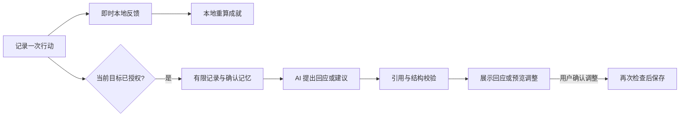

<div align="center">


# DayVault

### 日常值得记录，坚持值得被看见。

一个中文优先的原生 iPhone 日常记录器。用简单清单留下行动，让角色、折纸搭档与成就册陪这段记录一起成长。

**简体中文** · [English](README.en.md)

**版本：** [v1.1.0 更新介绍（中英双语）](docs/releases/v1.1.0.md) · [新版本发布页](https://github.com/Jack-Li-Npu/DayVault/releases/tag/v1.1.0) · [v1.0.0 原版介绍](https://github.com/Jack-Li-Npu/DayVault/blob/v1.0.0/README.md)

[看看界面](#看看界面) · [第一次使用](#第一次使用) · [本地运行](#本地运行) · [开发指南](docs/DEVELOPMENT.zh-CN.md) · [隐私说明](PRIVACY.md)

**Swift 6 · SwiftUI · iOS 18+ · 本地优先 · 可选 AI**

</div>


> **当前状态：可构建的开发原型，不是已发布的 App Store 产品。** 日常记录、已有成就判定和动画可离线使用。真实 AI 排程曾成功，但最新联调仍有上游 HTTP 504，不能视为稳定上线。私人接口、模型与密钥不随新版本发布，文档中的示例值是脱敏占位符。本文提供中英双语介绍，**App 首版界面仍以简体中文为主**。

## 为什么做 DayVault

有时，最想留下的不是一张排得很满的日程表，而是：“这件事，我真的坚持下来了。”

DayVault 从日常记录出发：健身、阅读、学习一门新东西，或完成一个小项目。它希望把平时不起眼的行动累积成可以回看、收藏、分享的成就。角色与动画负责表达这份满足；可选的 AI 搭档则根据经过授权的记录作出回应，而不是每天重复一句泛泛的鼓励。

这里仍然是一个记录器。没有必须完成的长问卷，没有强制聊天，也不需要先设计一整套人生目标。**打开 App，先记一件事就够了。**

## 看看界面

<table>
  <tr>
    <td align="center"><strong>今日清单</strong><br/>按顺序看安排，不被小时刻度淹没</td>
    <td align="center"><strong>轻量新增</strong><br/>标题和日期先行，复杂选项收起来</td>
    <td align="center"><strong>双人片段</strong><br/>把积累变成可以回看的小演出</td>
  </tr>
  <tr>
    <td align="center"></td>
    <td align="center"></td>
    <td align="center"></td>
  </tr>
</table>

*以上为真实 iOS 模拟器截图，使用隔离的示例数据或 UI 测试数据，不包含用户私人日记。双人片段截图是演出结束画面，不代表已经获得某项成就；页首横幅是原创品牌插画，不是 App 界面。*

## 先把今天记下来

- **首页就是今日事项。** 日期、顺序清单、紧凑的角色与搭档入口；日历、统计和设置位于“更多”。
- **只填标题也能保存。** 默认日期为当天，具体时间、时长、分类、重复、提醒、备注和模板折叠在“更多设置”。
- **计划与实际分开。** 可以直接完成，也可以开始计时再结束；直接完成不会凭空补一个实际用时。
- **原有能力不删掉。** 重复安排、单次改期、待安排收件箱、日终回顾、日历叠加、提醒和小组件继续保留。

三个时间状态有不同含义，不只是表单样式不同：

| 状态 | 例子 | 如何记录 |
| --- | --- | --- |
| 只指定日期 | 周五整理作品集 | 不偷偷变成凌晨零点的预约，也不计入计划分钟或准时率 |
| 指定日期与时刻 | 周五 19:00 训练 45 分钟 | 保留具体安排，可检查冲突并设置提醒 |
| 尚未安排日期 | 以后想读的一本书 | 留在待安排中，选好日期后再进入清单 |

## 让成就留下来

### 一套公共成就，一份个人经历

| | 公共成就册 | AI 个人成就 |
| --- | --- | --- |
| 内容 | 24 项内置成就：16 项明确、8 项隐藏 | 每个目标授权后，最多 2 项明确成就 + 1 项隐藏彩蛋 |
| 谁设计 | 随 App 发布的固定目录 | AI 根据当前目标及授权记录提出定义 |
| 谁判定 | 本地程序 | 本地程序，不由模型直接授予 |
| 展示 | 明确进度，隐藏项逐步出现信号 | 明确条件；隐藏项解锁前不显示名称、图案或数值规则 |
| 装备关系 | 保留原有六件装备的解锁条件 | 不影响公共装备资格或公共收集数量 |

“公共”指所有用户共用的成就目录，不代表你的记录会被公开。

个人成就只使用三类可以核算的规则：累计完成次数、不同完成日期、按已确认节奏累计达标的固定七天周期。规则启用后冻结；改期或聊天不会偷偷降低门槛。

历史记录需要你主动确认关联目标。它可以帮助个人成就达标，但会作为历史回顾，不写成“搭档陪你经历了这些年”。已获得的资格保留；如果原记录后来被更正，成就详情会如实说明依据变化。

### 角色是你，搭档陪你记录

原有原创角色可以穿戴由公共成就解锁的装备。新加入的折纸搭档是另一个小角色，不替代用户人物。

搭档按**开启陪伴后共同记录的不同日期**进入初识、合拍、默契三个阶段，节点为初始、7 天、30 天。休息或缺席不会降级，导入历史也不会虚增共同经历。

普通完成立即得到不足一秒的本地动作反馈；个人成就详情可打开约六秒的双人演出。支持跳过、回看及 Reduce Motion；回看不会增加进度。同次解锁合并轻提示，不用连续弹窗打断记录。

<table>
  <tr>
    <td align="center"><strong>角色与成就入口</strong></td>
    <td align="center"><strong>已获装备与试穿</strong></td>
    <td align="center"><strong>二级日历页面</strong></td>
  </tr>
  <tr>
    <td align="center"></td>
    <td align="center"></td>
    <td align="center"></td>
  </tr>
</table>

*Vault 与日历为当前版本截图；衣橱截图来自前一轮角色版本的隔离预览，展示本轮保留的穿搭系统。全部为示例数据，无真实 AI 回复或私人留言。*

分享前先预览卡片，可包含角色、成就、记录跨度，以及你选择的一段已确认回忆。私人留言默认不包含，图片在设备上生成；是否发给别人，由你在系统分享面板选择。

## AI 是可选搭档，不是另一个任务管理员

点击首页折纸角色，可围绕当前目标轻聊，不会进入一个独立的全能聊天首页。自动文字回应每天最多一次，重大个人成就可额外回应；主动发消息不受这个展示频率限制。

- **先授权，再使用目标记录。** 不默认发送所有日记、其他目标或 Calendar 标题。
- **经验由你确认。** AI 可以提议“这种安排可能更适合你”，但确认后才保存为长期记忆。支持查看依据、修改和删除。
- **记录更正，回应也要更新。** 来源失效后，不继续展示基于旧原文的回忆或回复。
- **排程只有提案权。** 可以建议移动当前目标未来七天内尚未开始的事项；先看前后差异，确认后才执行。
- **不暗中减量。** 这类调整不能删除任务、缩短时长、延长期限或修改整条重复规则。执行前重新检查状态、版本、休息约束和冲突；撤销也会检查后续修改。



成就设计、陪伴和排程分别使用版本化指令包，**构建时会打包到服务端按用途加载**，不只是放几个 Markdown 文件。模型输出要通过规则白名单、引用和范围校验，不能提交解锁时间或任意执行代码。[开发指南 →](docs/DEVELOPMENT.zh-CN.md)

## 第一次使用

1. 打开后点 **记一件事**，写下标题，保存。目标、AI、通知和 Calendar 都不是前置条件。
2. 完成时点清单中的勾选按钮；需要实际计时，再使用“开始”。
3. 点左上角人物进入 Vault，查看角色、衣橱与成就。
4. 想围绕一个长期方向积累时，再建立目标、关联已有记录。想试模板或让 AI 拆解模糊目标，打开 **AI 帮我排**。
5. 想开启目标级陪伴，点折纸角色，阅读发送范围并主动授权。模型不可用时会明确报错，日常记录不受影响。

内置挑战目前是**计划模板**，不是线上赛事报名、实时热门榜单或真实多人竞赛。当前没有虚构的“超过了多少人”或全球稀有度。

## 本地运行

需要 **macOS、Xcode 26 或更新版本**及可用的 iPhone 模拟器。部署目标为 iOS 18+；无需先配置 AI。

```bash
git clone https://github.com/Jack-Li-Npu/DayVault.git
cd DayVault
open DayVault.xcodeproj
```

仓库目前为私有，克隆需要仓库访问权限。在 Xcode 选择 **DayVault** Scheme 和 iPhone 模拟器，按 **⌘R**。项目文件已包含在仓库中，第一次运行不必重新生成。

真机运行需要设置自己的开发团队、Bundle ID、App Group 和 CloudKit 容器。修改工程定义后用 `xcodegen generate` 重新生成。完整步骤、模拟器隔离预览、AI 代理配置与排错见：

- [中文开发与运行指南](docs/DEVELOPMENT.zh-CN.md)
- [English development guide](docs/DEVELOPMENT.en.md)

### 真实 AI 当前状态

本地测试使用 `https://api.example.com`、`example-model`、`medium`。**2026-09-10** 用户授权继续联调后，初次排程通过真实代理生成了使用 `v1.1.0` 指令的演讲计划；此前基础连接、搭档与个人成就也曾成功。中转仍有间歇性超时；七天调整的 `invalid_structured_output` 尚未重新验收。[修复、验证范围及限制 →](docs/AI-PLANNER-LIVE-VALIDATION.zh-CN.md)

本轮只发送虚构测试数据，没有导入个人记录或将生成结果写入 App；**上述结果不是完整 iOS 端到端验证或生产上线证明**。旧模型 `example-legacy-model` 的 `400 / model_not_supported` 属于此前测试记录。原有排程页面的确定性本地预览仍有明确标记，不冒充模型回应。

## 技术与验证

**SwiftUI · SwiftData / CloudKit · EventKit · UserNotifications · WidgetKit / App Intents · StoreKit 2 · Swift Charts**

iOS 运行时不依赖第三方包。`DayVaultCore` 保存领域规则；App 负责界面、持久化和系统服务；可选 Deno / Supabase 代理负责调用模型，不能直接修改手机上的记录。

```text
DayVault/                 原生界面、系统服务、目标与陪伴协调
Packages/DayVaultCore/    版本化模型、重复规则、成就与 AI 契约
DayVaultWidgets/          App Group 快照与小组件
AI/Skills/               三类版本化指令包及行为样例
supabase/functions/      可选 AI 服务端代理与校验
DayVaultTests/            App 集成测试
DayVaultUITests/          中文界面回归
Design/                  原创素材、真实截图与验收方案
```

以下为 **2026-09-10 的本地验证记录**，不是托管 CI 或 App Store 审核结果：

| 测试范围 | 通过 | 代表性覆盖 |
| --- | ---: | --- |
| Core | 57 | 真实 V1 磁盘库迁移到 V2、重复事项、时区与个人规则 |
| App | 40 | 其中 25 项 Journey 集成测试：历史关联、授权撤销、失效来源、调整与保存失败回滚 |
| UI | 15 | 中文首页、轻量编辑器、日期精度、搭档可选、演出回看、大字体与减弱动态效果 |
| 服务端 | 30 | 中文契约样例、字段白名单、伪造引用与配置检查 |

签名真机、两台设备真实 CloudKit 汇合、系统权限变化、StoreKit 沙盒与性能仍需完成发布前验收。另有[陪伴价值比较方案](Design/Journey-Validation.md)：用相同动画比较“只有统计”与“加入真实历史回应”，该用户研究尚未执行。

## 隐私、边界与下一步

- 本地记录不需要 DayVault 账号，iCloud 同步使用用户私有数据库；可选 AI 是独立的数据发送边界。
- 没有广告 SDK、第三方分析、社交动态、排行榜或心理咨询。现有 Pro 选项保留在二级页面，没有新增启动付费墙。
- API 密钥只在服务端或本地开发代理，开发脚本使用 macOS Keychain；不要将密钥加入 iOS 配置、截图或提交。
- 分享卡不自动上传。删除本地内容不等于删除第三方服务已处理的数据；使用前应了解服务商的数据处理政策。[完整隐私说明 →](PRIVACY.md)

下一步先完成真实 AI 兼容性验证、真机同步与权限测试，再用小范围用户反馈判断“被真实记录回应”是否值得继续投入。短期不扩张排行榜、挑战商城、MCP 或复杂养成经济。

## 参与开发与设计参考

修改应围绕记录、可信成就和可选陪伴。行为变更补测试；新增文案维护中文版本与英文文档；截图只使用隔离示例数据。详细命令见开发指南。

界面使用纸感底色、粗线框、克制的高亮色和代码绘制角色。公开 CodePen / GitHub 项目用于交互与设计研究，参考和归属说明见 [ATTRIBUTIONS.md](ATTRIBUTIONS.md)。

**仓库目前没有授予项目级开源许可证。** 可访问仓库不等于已获得重新分发许可；未来是否开源、采用何种许可证，由维护者另行决定。这里也不提供不存在的 App Store 下载或公开在线演示链接。
