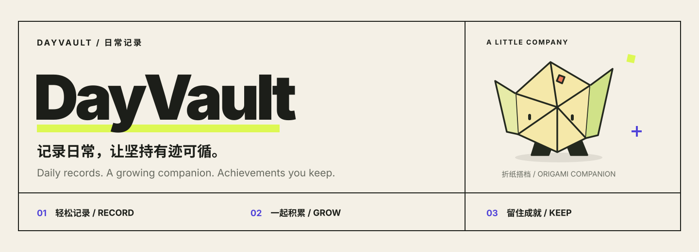
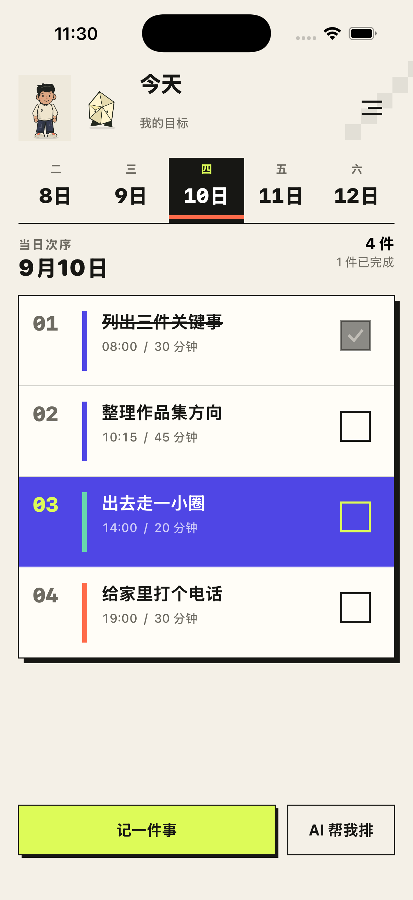
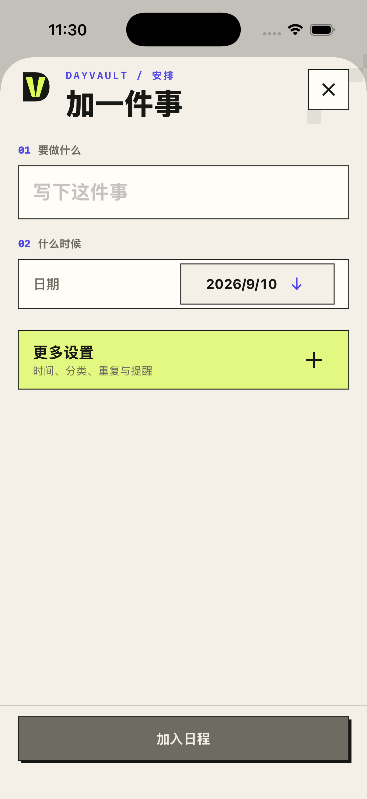
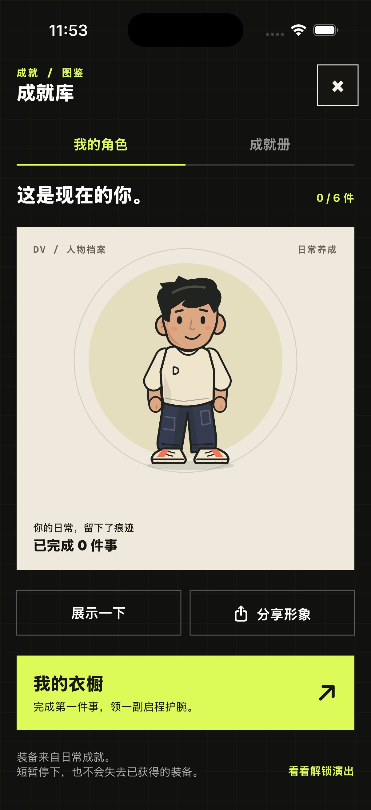
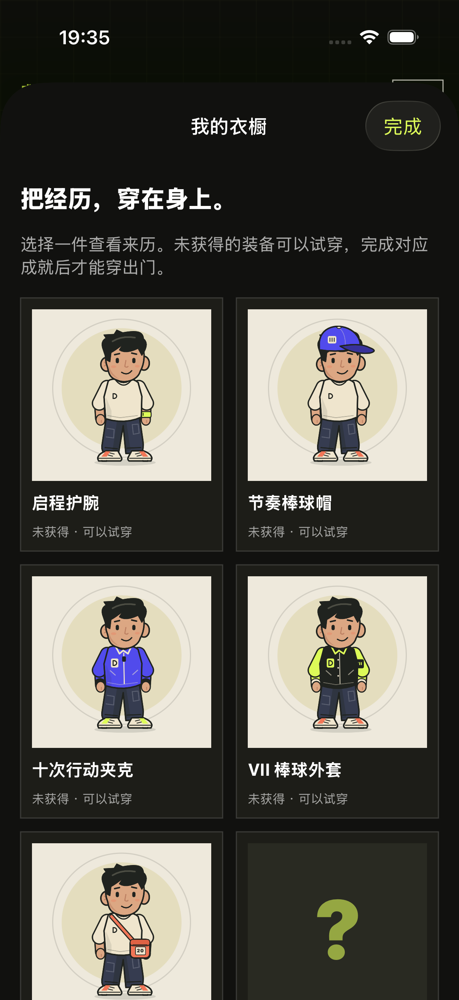
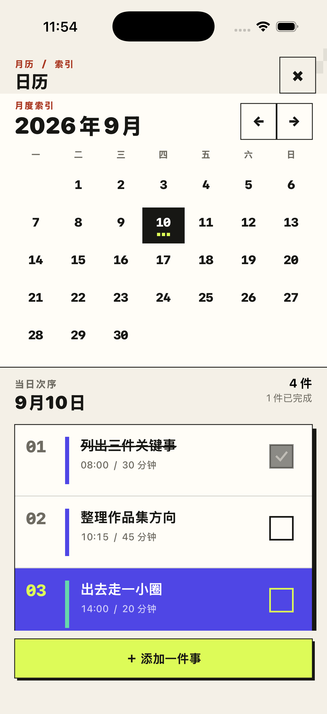
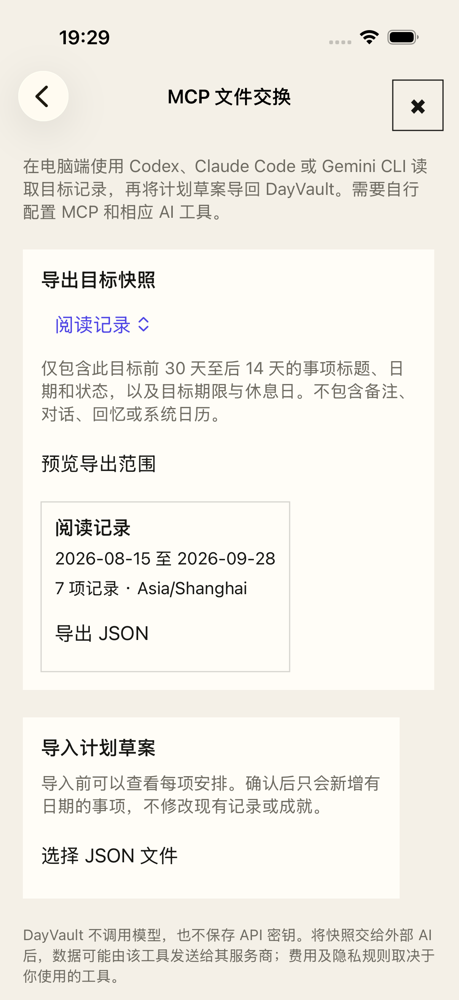
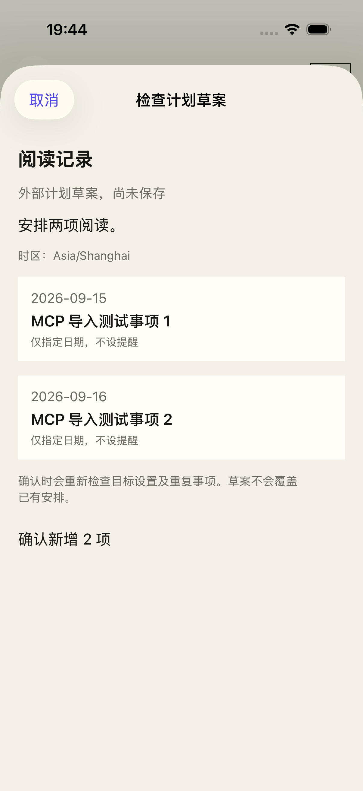

# DayVault

一张日常清单，一本留得住的成就册。

**简体中文** · [English](README.en.md)

[开始使用](#第一次使用) · [本地运行](#本地运行) · [MCP 接入](docs/MCP.zh-CN.md) · [开发指南](docs/DEVELOPMENT.zh-CN.md) · [隐私](PRIVACY.md)



DayVault 是一个简体中文 iPhone 日常记录器。记下今天的安排，完成后勾选；积累的记录可以解锁成就和角色装备。首页保留顺序清单，不要求先建目标、填问卷或开始聊天。

项目起于一个很具体的念头：坚持训练、阅读或学习很久之后，想把这段付出拿出来看看，也想分享给别人。成就册、原创人物和可以回看的演出，都是围绕这些记录做的。

v1.4 停用 App 内 AI，增加可选的本地 MCP 文件交换。日常记录、已有成就判定和动画不需要 AI 服务；需要辅助规划时，可以把所选记录交给自己使用的外部 AI 工具。DayVault 不代付模型费用，也不在后台自动安排事项。

这是源码发布，尚未上架 App Store。“收尾版”指本轮实验的范围已确定，不代表所有上线检查已经完成，也不是永不维护的承诺。

## 版本记录

- [v1.4.0](docs/releases/v1.4.0.md)（当前版本） · 离线记录与可选 MCP 文件交换 · [发布页](https://github.com/Jack-Li-Npu/DayVault/releases/tag/v1.4.0)
- [v1.3.0](docs/releases/v1.3.0.md) · 个人成就文案修订 · [发布页](https://github.com/Jack-Li-Npu/DayVault/releases/tag/v1.3.0)
- [v1.2.0](docs/releases/v1.2.0.md) · 界面命名与成就文案 · [发布页](https://github.com/Jack-Li-Npu/DayVault/releases/tag/v1.2.0)
- [v1.1.0](docs/releases/v1.1.0.md) · 排程指令、连接修复与私人配置 · [发布页](https://github.com/Jack-Li-Npu/DayVault/releases/tag/v1.1.0)
- [v1.0.0](https://github.com/Jack-Li-Npu/DayVault/blob/v1.0.0/README.md) · 原版存档 · [发布页](https://github.com/Jack-Li-Npu/DayVault/releases/tag/v1.0.0)

[全部发布版本](https://github.com/Jack-Li-Npu/DayVault/releases)

## 界面

<table>
  <tr><th align="center">今日清单</th><th align="center">新增事项</th><th align="center">演出回看</th></tr>
  <tr>
    <td align="center"></td>
    <td align="center"></td>
    <td align="center"></td>
  </tr>
</table>

以上为历史版本的真实模拟器截图，全部使用隔离的示例数据。旧图中的 AI、聊天入口已移除；当前功能以本文及 v1.4 说明为准。横幅是品牌插画，不是 App 截图。

## 日常记录

只填标题即可保存，日期默认是今天。时刻、时长、分类、重复、提醒和模板收在高级选项中。日历、统计、外观及设置在二级入口，不占满首页。

事项可以仅指定日期，也可以指定具体时刻，或先放进待安排。没有时刻的事项不算午夜预约，也不参与计划分钟、准时率和时间冲突统计。完成时直接勾选即可；需要记录实际用时，再使用“开始”。计划时间和实际时间分别保留。

重复安排支持单次改期。目标可以手动创建，再关联相关事项。Apple Calendar 叠加、提醒和小组件保留，拒绝 Calendar 或通知权限不会妨碍基本记录。

## 成就与人物

公共成就册有 24 项成就，其中 8 项隐藏。明确成就显示条件与进度；隐藏项解锁前只给信号和线索。六件人物装备与公共成就对应。“公共”指所有人使用同一份目录，你的记录不会因此公开。

已有个人成就继续按保存的规则在本地判定，条件包括完成次数、不同完成日期或达标周期。旧记录只有经过确认并关联目标后才会计入。已获资格保留，之后更正记录时，详情会说明依据的变化。v1.4 不再生成新的个人成就，也不会虚构“超过全球多少用户”的比例。

<table>
  <tr><th align="center">角色与成就</th><th align="center">装备试穿</th><th align="center">日历</th></tr>
  <tr>
    <td align="center"></td>
    <td align="center"></td>
    <td align="center"></td>
  </tr>
</table>

这组截图同样来自早期版本的示例数据，保留作设计参考。

普通完成得到短反馈；多项解锁合并提示。约六秒的双人演出可以跳过或回看，回看不增加进度。“减弱动态效果”使用静态结果与短淡入。折纸搭档是本地动画角色，不代表 AI 正在回复。

分享卡可以包含人物、成就、记录跨度和你选择的一段已确认回忆。先预览，再决定发到哪里；私人留言默认不包含，图片不会自动上传。

## 可选 MCP：把一份记录交给自己的 AI

v1.4 的 MCP 服务运行在 macOS / Linux 电脑上，面向支持本地 stdio MCP 的工具。仓库提供 Codex、Claude Code 和 Gemini CLI 的配置说明。它不读取这些工具的聊天历史，也不在 iPhone 上监听端口。Windows 的文件权限保护尚未验证。

<table>
  <tr><th align="center">导出目标快照</th><th align="center">确认计划草案</th></tr>
  <tr>
    <td align="center"></td>
    <td align="center"></td>
  </tr>
</table>

v1.4 的真实模拟器截图。阅读目标、七条记录和两项草案均为隔离的合成测试数据，不包含私人记录，也不是付费模型的实际答复。

1. 在 App 的“设置 → MCP 文件交换”中选一个目标，预览后导出 JSON 快照，再自行传到电脑。
2. 外部 AI 通过 MCP 读取快照，提出新增事项草案。模型由你选用的工具提供，费用及数据政策也由该工具决定。
3. 把草案文件传回 iPhone，检查预览，确认后才保存。

快照包含所选目标及过去 30 天到未来 14 天范围内的相关事项，不含笔记、聊天、回忆、Calendar 数据或隐藏成就规则。它不是完整备份，也不会自动同步。

首版草案只允许新增有日期、无具体时刻、不重复的事项。MCP 不能完成或删除事项、改写原计划、授予成就。App 保存前再次检查日期、休息日、目标期限和重复项；文件中的文字不能替代你的确认。

[中文接入指南](docs/MCP.zh-CN.md) · [English setup](docs/MCP.en.md) · [数据契约](docs/MCP-CONTRACT.md)

## 第一次使用

1. 点“新增事项”，填标题并保存。
2. 完成后勾选，点人物查看成就和装备。
3. 需要长期整理时再创建目标；MCP 完全可选，不配置也能使用 App。

旧版接受的计划、目标、个人成就以及历史对话没有因停用 App 内 AI 而清空。有历史内容的目标仍可查看和管理历史陪伴记录。旧代理代码和指令包留在仓库中供研究，不能通过填写旧密钥恢复当前 App 的 AI 功能。

## 本地运行

需要 Mac、Xcode 26 或更新版本，以及 iPhone 模拟器。最低系统为 iOS 18，当前 App 和小组件使用简体中文；英文文档不代表已提供英文界面。

```sh
git clone https://github.com/Jack-Li-Npu/DayVault.git
cd DayVault
open DayVault.xcodeproj
```

选择 DayVault Scheme 和模拟器，按 ⌘R。常规运行不需要 API 密钥、Node.js 或 AI 代理。真机需要配置自己的开发团队、Bundle ID、App Group 和 CloudKit 容器。修改工程结构后，用 `xcodegen generate` 更新工程。

App 使用 SwiftUI、SwiftData / CloudKit、EventKit、WidgetKit、StoreKit 2 和 Swift Charts，没有第三方 iOS 运行时包。重复规则与成就判定位于 `Packages/DayVaultCore`；可选 MCP 服务单独位于 `MCP`。

## 验证与未完成事项

v1.4 完整回归通过：Core 71/71、App 单元与集成测试 76/76、UI 22/22、MCP 33/33。App 与 UI 共 98 项，没有失败或跳过。Release 配置的 iOS 模拟器构建通过，产物版本已核对为 1.4.0、构建号 5；这不等于真机签名归档。测试范围和历史基线见[版本说明](docs/releases/v1.4.0.md)，不同批次不相加。

该项目尚未完成 App Store 上架验收。真机权限、跨设备 CloudKit、购买沙盒、真实旧版升级和锁屏隐私仍需要检查。本地 StoreKit 文件不是已上线商品；Pro 保留在二级页面，本版没有新增付费墙或改变售价。[上架收尾清单](docs/APP-STORE-LAUNCH-PLAN.zh-CN.md)

## 隐私与参与

基本记录保存在设备和可用的私人 iCloud 数据库中。App 不请求模型服务。使用 MCP 时，所选外部 AI 工具可能把快照内容发送给模型提供商；本地运行 MCP 不等于模型也在本地。停用旧 AI 功能也不会撤回历史上已发送的数据。[完整隐私说明](PRIVACY.md)

没有广告 SDK、第三方分析或排行榜。项目不承诺托管 AI 服务，也不扩展挑战商城和复杂养成经济。

界面采用纸感底色、粗线框和代码绘制人物。设计来源见 [ATTRIBUTIONS.md](ATTRIBUTIONS.md)，中英文编辑规范见 [文案维护](docs/WRITING.md)。行为改动请附测试；截图和问题报告不要包含私人记录、快照或密钥。参与前请阅读 [贡献说明](CONTRIBUTING.md) 和 [安全报告说明](SECURITY.md)。项目级再分发许可证仍待确认，公开访问不等于已获得再分发许可。
